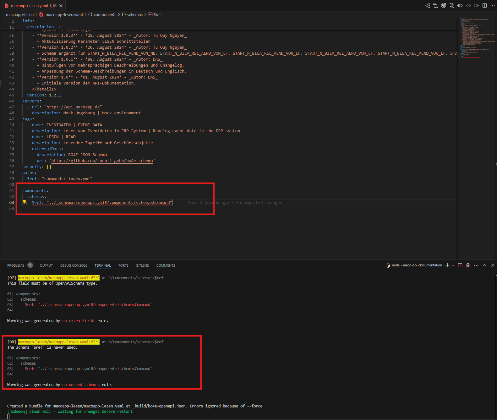

## How to generate a single openapi.yaml file from multiple openapi.yaml files using swagger-cli
The result files will be minifed and located in the _build/ directory.
```
_build/bo4e-openapi.min.json
_build/events-openapi.min.json
```

### Developing/buidling
If you need to change some thing in this repo, you can run the following command to start the development server.
```
nodemon
```
if any were not correct, you will see errors like this:



### requiments for develop/build
- nodejs
- nodemon
- swagger-cli
- python3

## How to install swagger-cli
```
npm install -g swagger-cli
```

## How to install nodemon
```
npm install -g nodemon
```

## How to install nodejs
```
sudo apt install nodejs
```

## How to install python3
```
sudo apt install python3
```